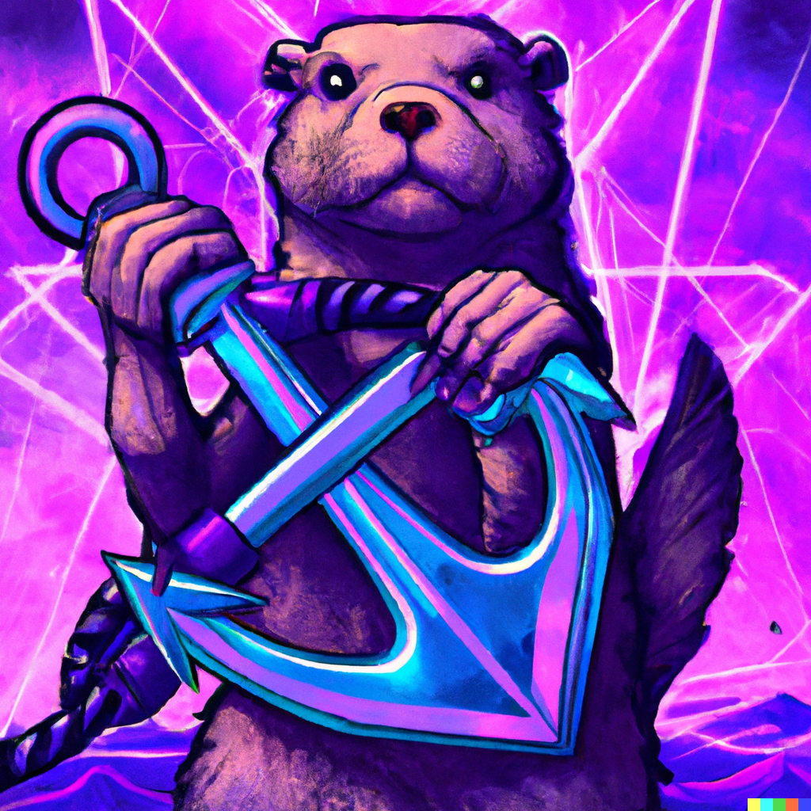

# anchor-go



## usage

```bash
anchor-go --src=/path/to/idl.json
```

Generated Code will be generated and saved to `./generated/`.

## TODO

- [x] instructions
- [x] accounts
- [x] types
- [ ] events
- [ ] errors
- [ ] handle tuple types
- [ ] constants

## Future Development

`anchor-go` is exclusively supported by my own time (which is money).

If my work has been useful in building your for-profit services/infra/bots/etc., consider donating at DkP56dVfmTTN58oy6hDpRLtw4RMEFMmEWs8umN3Kg8vp

Thanks!

## what is anchor-go?

`anchor-go` generates Go clients for [Solana](https://solana.com/) programs (smart contracts) written using the [anchor](https://github.com/project-serum/anchor) framework.

## what is anchor?

Link: https://github.com/project-serum/anchor

```
Anchor is a framework for Solana's Sealevel runtime providing several convenient developer tools for writing smart contracts.
```

## I have an anchor program; how do I generate a Go client for it? (step by step)

### example 1: metaplex nft candy machine

```bash
git clone https://github.com/metaplex-foundation/metaplex-program-library.git
cd metaplex-program-library
anchor idl parse -f candy-machine/program/src/lib.rs -o nft_candy_machine_v2.json
anchor-go --src=nft_candy_machine_v2.json
```

Note
----

- anchor-go is in active development, so all APIs are subject to change.
- This code is unaudited. Use at your own risk.
